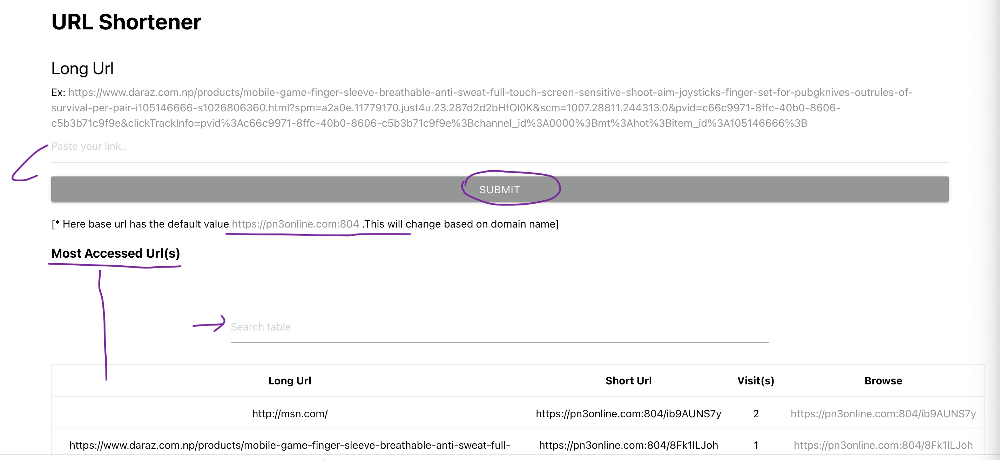

# url-shortener-frontend
Url Shortener FrontEnd

<h4 align="center">Creating custom URL shortener front-end With Reactjs</h4>
<div align="center">
  <sub>Built with ❤︎ </sub>
</div>

</br>
Building a custom URL shortening GUI using React, React-router and Materialize css

## Architecture Design


## Technologies

 ### Front end

  - [React](https://reactjs.org/) - JavaScript library for building user interfaces.
  - [React-router](https://github.com/ReactTraining/react-router)- Complete routing library for React
  - [Materialize css](http://materializecss.com/)- Responsive front-end framework based on Material Design

## Getting Started

#### Clone the project

```sh
# clone it
git clone https://github.com/rakeshkumargupta/url-shortener-frontend.git
cd url-shortener-frontend
# Make it your own
rm -rf .git && git init
```

#### Run back end
Check repository https://github.com/rakeshkumargupta/url-shortener-backend for running back end NodeJS api.


#### Run front end

```
# Install dependencies
yarn install
# Start  client
yarn start
```

## License 

GNU